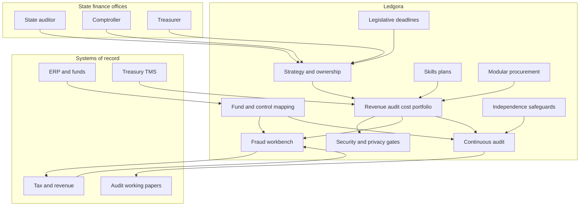

# Ledgora

**Source:** `ai-in-gov/Deloitte_NASACT_survey_report/`
**Domain:** `ai-gov`
**One-liner:** A digital-readiness and automation control system for state auditors, comptrollers, and treasurers — tying strategy, workforce, procurement, and continuous audit/finance use cases to fund-accounting and single-audit reality.
**Wedge:** US state NASACT-member shops (auditor / comptroller / treasurer) stuck at early/developing digital maturity without a coherent strategy — starting with revenue-collection fraud analytics, continuous audit sampling, and improper-payment controls before any “digital transformation” branding exercise.
**Positioning:** Finance-office transformation software for state government, not generic public-sector digital maturity slides. Deloitte’s NASACT 2015 survey of 33 members shows strategy drives maturity, revenue collection/auditing/cost management feel the most impact, and culture/workforce/procurement block progress; Ledgora operationalises those findings inside appropriation, fund accounting, materiality, and auditor-independence constraints.

## Market research synthesis

### Thesis from source

The Deloitte–NASACT Digital Government Transformation Survey asked how digital trends reshape state financial organisations. Nearly all respondents acknowledged digital’s opportunity to work better with agencies (90%), customers (87%), employees (84%), and business partners (63%). Top barriers were insufficient funding (73%), competing priorities (52%), security (39%), and privacy (36%). At least two-thirds found culture, leadership, workforce, and procurement challenging. Digital maturity split the field: digitally maturing organisations were nearly three times more likely to have a clear strategy (90% vs 30% for early/developing). More than half of surveyed organisations lacked a clear digital strategy. Among those with strategy, >60% had a leader/group accountable; 81% said digital trends improved response to threats/opportunities vs about half without strategy. Culture was a significant challenge for 88%.

On mindset, less than a quarter of NASACT respondents said citizen demand primarily drove digital transformation (vs 35% globally for finance shops); less than 10% reported high citizen co-creation; only 15% used open source to a moderate/great extent; only 9% said digital made them more willing to experiment with agile (vs four times higher globally). The activities most impacted were **revenue collection, auditing, and cost management**, with process automation and analytics as primary enablers for cost efficiency and operational automation. New York State’s predictive fraud work is cited against a federal backdrop where fraudulent returns rose >$4B (40%) from 2011–2012. Texas TxSmartBuy showed user-centred procurement redesign cutting maintenance cost 72%. Checkbook NYC illustrated open-source transparency portals with vendor exporter ecosystems. Workforce skills were the most challenging part of transition for more than half of agencies; procurement rules/flexibility and low vendor satisfaction blocked delivery — agencies wanted agile, less restrictive T&Cs, and modular development.

Ledgora’s product thesis: maturity theatre fails; what works is a controlled path from strategy → accountable owner → prioritised finance use cases (revenue integrity, continuous audit, cost/cash) → workforce skills plans → modular procurement packages — with fund, appropriation, materiality, and independence controls baked in.

### Buyer & economic model

- **Primary buyer:** State Comptroller, State Auditor, or State Treasurer (NASACT member), often with a deputy for innovation/IT.
- **Users:** audit managers, revenue/tax integrity analysts, treasury cash managers, financial reporting teams, internal control owners, procurement officers, digital/strategy leads, legislative budget liaisons.
- **Budget owner / value metric:** financial-management IT and audit operations budgets. Value metrics: digital strategy coverage and owner accountability; improper-payment and fraudulent-return detection yield; continuous-audit coverage vs cyclical sampling only; close/reporting cycle time; procurement cycle time for modular digital buys; skills-gap closure.
- **Competing status quo:** ERP upgrades without strategy, one-off fraud tools, annual audit sampling only, waterfall procurements, and consulting maturity assessments that do not connect to fund ledgers or single-audit packages.

### Domain constraints

- **Regulatory / trust / safety:** appropriation and fund accounting rules; internal control frameworks; single-audit requirements; materiality and sampling standards; fraud and improper payments; legislative reporting deadlines; auditor independence (especially when auditors also advise on systems); security/privacy as named top barriers.
- **Data sensitivity:** taxpayer data, banking/treasury positions, beneficiary payment files, vendor master data, working-paper evidence.
- **Change-management realities:** 73% cite funding and 52% competing priorities — wedges must show cash/fraud/audit ROI quickly; culture (88%) and skills (>50%) block tooling alone; procurement reform is part of the product path, not an external hope.

## Business requirements

- BR-1: Every participating office must maintain a living digital strategy object with accountable owner, roadmap milestones, and threat/opportunity response notes — because strategy presence is the survey’s strongest maturity correlate.
- BR-2: Use-case portfolio must prioritise revenue collection integrity, auditing, and cost management ahead of generic “citizen app” work unless citizen co-creation is explicitly funded.
- BR-3: Fraud and improper-payment models must operate against payment and return streams with documented sampling/materiality logic and human adjudication before recovery actions.
- BR-4: Continuous-audit procedures must preserve auditor independence: system configuration by auditee management cannot be solely controlled by the external/state auditor team without safeguards.
- BR-5: All automation must map to funds, appropriations, and internal-control assertions so outputs are usable in CAFRs and single-audit evidence packs.
- BR-6: Workforce skills plans must cover technical, business-application, collaboration, and iterative-risk skills — matching the survey’s expanded definition — with organisational support tracked.
- BR-7: Procurement packages for digital work must support modular, agile statements of work and less restrictive T&Cs playbooks that still meet state purchasing law.
- BR-8: Security and privacy impact assessments are mandatory gates before analytics go live, addressing the 39%/36% barrier rates.
- BR-9: Transparency releases (checkbook-style) must reconcile to fund ledgers and carry open-licence terms without breaking appropriation confidentiality rules.
- BR-10: Legislative reporting deadlines must appear as calendar controls on close, audit opinion, and treasury reports, with risk flags when digital initiatives jeopardise them.
- BR-11: Culture interventions (innovation, collaboration, transparency) must be measurable, not poster values — tied to the survey’s mature-cohort norms.
- BR-12: Commercial pricing should align to verified improper-payment recovery, audit-hour shift from manual sampling to exception review, and strategy-milestone attainment — not seat licences alone.

## User stories

Canonical user stories live in sibling [USER_STORIES.md](USER_STORIES.md).

## System design

### Overview

Ledgora is the control plane for state finance digital transformation: strategy and ownership, use-case portfolio biased to revenue/audit/cost, fund-aware automation controls, continuous-audit and fraud workflows with human adjudication, workforce and procurement enablement, and legislative deadline risk. It integrates with ERP/fund ledgers, tax/revenue systems, treasury, and audit working-paper tools without replacing the system of record.

### Actors & boundaries

- **Actors:** NASACT executives, audit/revenue/treasury teams, internal control owners, procurement, workforce/HR, legislative liaisons, vendors.
- **Trust boundary:** taxpayer and payment data stay in revenue/ERP systems; Ledgora stores control metadata, risk scores, and working-paper references; auditor and auditee roles are separated for independence.
- **Human-in-the-loop points:** fraud recovery approval; audit exception disposition; strategy milestone acceptance; procurement package approval; emergency halt on independence breach.

### Core capabilities

1. **Digital strategy and ownership** — living strategy, owner, milestones.
2. **Use-case portfolio (revenue, audit, cost)** — prioritisation and funding against competing priorities.
3. **Fund and appropriation mapping** — tie automations to funds/controls/assertions.
4. **Fraud and improper-payment workbench** — leads, adjudication, recovery.
5. **Continuous audit and materiality** — exception queues with sampling logic.
6. **Independence and control safeguards** — role separation and halt rights.
7. **Workforce skills planning** — gap, support, progress.
8. **Modular procurement playbooks** — agile SOW/T&C packages.
9. **Security and privacy gates** — mandatory pre-go-live.
10. **Legislative deadline and transparency reporting** — calendar risk and checkbook-style releases.

### Conceptual data

- **Primary entities:** StateOffice, DigitalStrategy, StrategyMilestone, UseCase, FundMapping, ControlAssertion, FraudLead, AdjudicationDecision, AuditException, MaterialityRule, IndependenceCheck, SkillsPlan, ProcurementPackage, PrivacyGate, SecurityGate, LegislativeDeadline, TransparencyRelease, VendorScore.
- **Critical events:** strategy published, use case funded, fraud lead opened/adjudicated, audit exception closed, independence halt, procurement package awarded, privacy/security gate passed/failed, deadline risk raised, transparency release published.
- **Retention / audit needs:** adjudications, exceptions, independence checks, and strategy history retained for single-audit and legislative inquiry windows; taxpayer raw data not retained in Ledgora beyond references.

### Integrations (conceptual)

- **Systems of record:** state ERP / fund accounting, tax and revenue systems, treasury/TMS, payroll/benefits payment systems, audit management / e-working papers, procurement systems.
- **Upstream signals:** payment files, return filings, vendor masters, CAFR calendars, NASACT peer benchmarks (optional), security findings.
- **Downstream actions:** recovery cases, audit programs, legislative status reports, procurement solicitations, transparency portal feeds, workforce learning assignments.

### High-level architecture

### Success metrics

- **Leading:** presence of coherent strategy with owner (move from 30% toward 90% pattern); % portfolio spend in revenue/audit/cost; fraud leads adjudicated within SLA; continuous-audit coverage ratio; skills-plan support rate; modular procurements as share of digital buys; gate pass-through time.
- **Lagging:** improper-payment and fraudulent-return recovery yield; audit hours shifted to exception review; close/reporting cycle time; vendor satisfaction uplift; maturity cohort movement; zero independence breaches; legislative deadlines met during transformation.

## OpenAPI skeleton

Canonical HTTP surface lives in sibling [openapi.yaml](openapi.yaml). Summary:

- **Base path:** `/v1/...`
- **Auth:** `X-API-Key` for ERP/revenue/audit-tool integration; Bearer JWT for office operators.
- **Resource groups:** Strategies, Portfolio, Fraud, Audit, Funds, Workforce, Procurement, Gates.
