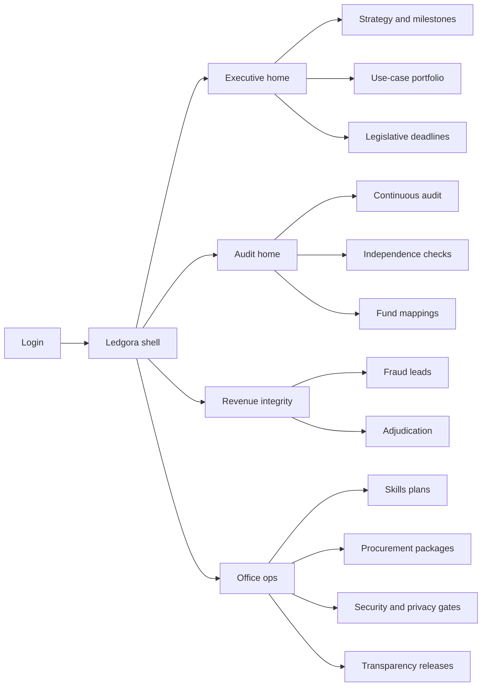
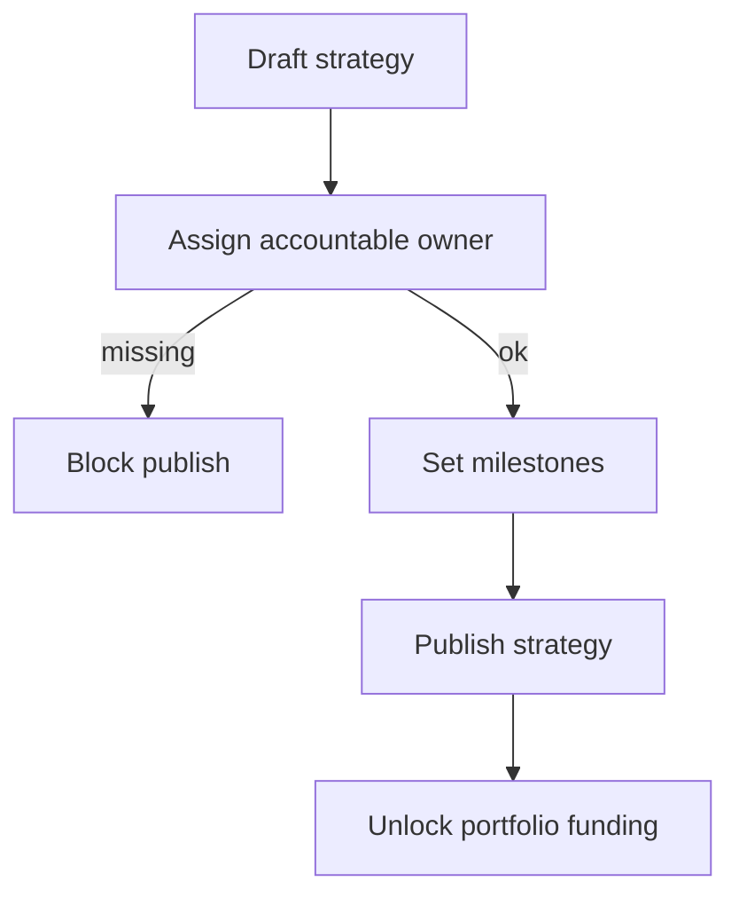
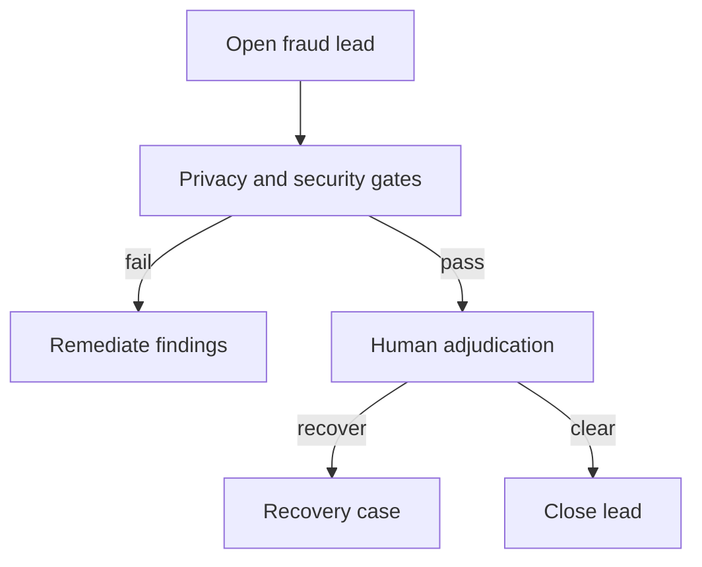

# Ledgora — Web app

**Product:** [PRODUCT.md](./PRODUCT.md)
**Primary surface:** State finance-office control console (comptroller / auditor / treasurer workspaces under one Ledgora shell)
**Secondary surfaces:** Legislative deadline briefing export (read-only PDF); checkbook-style transparency release preview (read-only, fund-reconciled)
**Design thesis:** Ledgora is a fund-aware control room for NASACT shops — not a digital-maturity slide deck. The metaphor is an appropriation ledger meeting an exception queue: strategy ownership, revenue-integrity leads, and continuous-audit materiality share one visual grammar of locked fund codes, gate stamps, and independence halts. Cool navy ink on parchment-cool grey (not cream-terracotta, not purple AI), with fiscal-year amber for deadline risk and seal-red only for independence breaches. The Ledgora wordmark sits as a quiet mint on every money- or opinion-bearing screen so offices know which control plane owns the evidence pack.

## UX research synthesis

### Category peers (best-in-class)

- **Workiva (Wdesk / gov reporting):** Cross-linked narrative + numbers with locked cells and evidence attachments for CAFR/assurance packages. Steal: document-to-control linkage and immutable period locks; reject generic “collaboration board” chrome that hides fund/appropriation context.
- **Wolters Kluwer TeamMate+:** Audit program → working paper → finding lifecycle with role separation. Steal: exception queues with reviewer disposition and independence-aware role gates; reject consulting-firm “maturity radar” as the home screen.
- **CaseWare IDEA / Galvanize (ACL) Analytics:** Continuous-monitoring dashboards with sampling and materiality context on exception lists. Steal: materiality-aware exception ranking and export to working papers; reject black-box “risk score” without sampling logic.
- **Oversight Systems / APP fraud suites:** Improper-payment lead workbenches with adjudicate → recover loops. Steal: human adjudication before recovery; reject consumer-fintech “alert spam” density without fund mapping.

### Patterns to adopt / reject

- **Adopt:** Living strategy object with named owner as first-class nav; portfolio forced-rank toward revenue / audit / cost; fraud lead → adjudicate → recovery with privacy gate stamps; continuous-audit exceptions with materiality rules visible; independence halt as a blocking banner; modular procurement package templates; legislative deadline calendar as chrome, not a buried report.
- **Reject:** Generic digital-maturity heatmaps as the product; citizen-app showcase galleries ahead of revenue integrity; editable recovery totals; purple “AI insights” side panels; dashboard-of-everything home that buries strategy ownership and fund codes.

### Trust, density, and workflow constraints from PRODUCT.md

Operators need finance- and audit-grade density without storing raw taxpayer files in Ledgora (references only). Auditor vs auditee configuration must stay visually and accessibly separated (BR-4). Security/privacy gates block go-live (BR-8). Automation outputs must carry fund, appropriation, and control-assertion badges so they survive single-audit packages (BR-5). Culture and skills work is measurable plans, not posters (BR-6, BR-11). Funding and competing-priority pressure (survey barriers) means every home answers “what yields cash or audit hours this quarter?”

## Information architecture

### Nav model

### Roles → default home

| Role | Default home | Why |
|------|--------------|-----|
| Comptroller / treasurer executive | Executive home — strategy owner + portfolio yield | Strategy is the maturity correlate (BR-1, BR-2) |
| Audit manager | Continuous audit exceptions | Hours on high-risk items (BR-3, BR-4) |
| Revenue integrity analyst | Fraud lead queue | Prioritized returns/payments (BR-3) |
| Procurement officer | Modular procurement packages | Agile SOW path (BR-7) |
| Workforce / strategy lead | Skills plans + gates | Barriers managed in-portfolio (BR-6, BR-8) |
| Legislative liaison | Legislative deadlines | Calendar risk on close/opinion (BR-10) |
| Internal control owner | Fund mappings and assertions | CAFR / single-audit evidence (BR-5) |

### Cross-links to OpenAPI resources

| Nav area | OpenAPI tags / resources |
|----------|---------------------------|
| Strategy and milestones | Strategies |
| Use-case portfolio | Portfolio |
| Fraud leads / adjudication | Fraud |
| Continuous audit / materiality | Audit |
| Fund mappings / control assertions | Funds |
| Skills plans | Workforce |
| Procurement packages | Procurement |
| Security, privacy, independence, deadlines | Gates |

## Screen inventory

### Executive home

- **Purpose:** Answer “do we have an owned strategy, and is portfolio spend on revenue/audit/cost?” in one composition.
- **Entry:** Post-login for comptroller/treasurer; deep link from deadline risk alerts.
- **Layout regions:** Brand + office switcher; strategy status strip (owner, milestone %, threat/opportunity notes); portfolio mix chart (revenue/audit/cost vs other); deadline risk rail; open independence/gate blockers.
- **Primary actions:** Open strategy; fund a use case; jump to at-risk deadlines.
- **Empty / loading / error:** Empty = guided “create living strategy + assign owner”; loading = skeleton strip + table; error = retry with request id.
- **BR / story ties:** BR-1, BR-2, BR-10; comptroller/treasurer stories.

### Digital strategy and milestones

- **Purpose:** Maintain the living strategy object that correlates with maturity in the NASACT survey pattern.
- **Entry:** Executive nav → Strategy; create from home CTA.
- **Layout regions:** Strategy header (owner, published state); milestone timeline; threat/opportunity response notes; culture intervention metrics panel (measurable, not posters).
- **Primary actions:** Publish/update strategy; accept milestone; assign owner; export for legislative brief.
- **Empty / loading / error:** Empty = template for early/developing offices; validation on missing owner.
- **BR / story ties:** BR-1, BR-11.

### Use-case portfolio

- **Purpose:** Force-rank and fund initiatives with revenue collection, auditing, and cost management ahead of generic citizen apps unless explicitly funded.
- **Entry:** Executive nav → Portfolio.
- **Layout regions:** Ranked use-case table (category, funding, gate status, yield metric); filter by revenue/audit/cost; competing-priority warning when non-core spend dominates.
- **Primary actions:** Create use case; fund/reprioritize; open linked gates; open fraud or audit surfaces.
- **Empty / loading / error:** Empty = seed three priority templates (fraud, continuous audit, cost/cash).
- **BR / story ties:** BR-2, BR-12.

### Fraud and improper-payment workbench

- **Purpose:** Prioritized leads from returns/payments with human adjudication before recovery.
- **Entry:** Revenue integrity default; portfolio deep link.
- **Layout regions:** Lead queue (score, stream, fund badge, SLA); lead detail with payment/return references (no raw PII dump); adjudication pane; recovery case handoff status; privacy-gate stamp.
- **Primary actions:** Adjudicate; open recovery; retrain feedback under privacy controls; halt if gate fails.
- **Empty / loading / error:** Empty = healthy “no open leads above threshold”; error = upstream tax/ERP sync failure banner.
- **BR / story ties:** BR-3, BR-8; revenue analyst stories.

### Continuous audit and materiality

- **Purpose:** Exception queues with sampling/materiality logic so scarce hours go to high-risk items.
- **Entry:** Audit home default.
- **Layout regions:** Exception table (materiality context, fund, assertion, disposition); materiality rule drawer; working-paper reference links; independence status chip.
- **Primary actions:** Dispose exception; adjust materiality rule (with audit trail); export evidence pack slice; raise independence check.
- **Empty / loading / error:** Empty = coverage healthy message with next procedure run time.
- **BR / story ties:** BR-3, BR-4, BR-5; audit manager stories.

### Independence and halt

- **Purpose:** Keep auditor opinion defensible when analytics are auditee-configured; emergency halt when rules breach.
- **Entry:** Audit nav; blocking banner from any automation screen.
- **Layout regions:** Independence check list; role-separation diagram (auditor vs auditee config); halt control with reason codes; affected use-case list.
- **Primary actions:** Record check; issue halt; notify portfolio owners; clear halt with dual control.
- **Empty / loading / error:** Empty = checks current; halt active = seal-red full-width banner, cannot dismiss without role.
- **BR / story ties:** BR-4; emergency halt story.

### Fund and appropriation mapping

- **Purpose:** Tie every automation to funds, appropriations, and internal-control assertions for CAFR/single-audit usability.
- **Entry:** Audit/ops nav → Funds.
- **Layout regions:** Mapping table; assertion checklist; use-case linkage; transparency confidentiality flags.
- **Primary actions:** Add mapping; link assertion; validate against ERP fund codes.
- **Empty / loading / error:** Unmapped automation = blocking banner on related use case.
- **BR / story ties:** BR-5, BR-9.

### Workforce skills plans

- **Purpose:** Close technical, business-application, collaboration, and iterative-risk skills with organisational support tracked.
- **Entry:** Ops nav → Skills.
- **Layout regions:** Skills-gap plan list; support flags; progress against portfolio needs; assignment links.
- **Primary actions:** Create plan; mark support committed; sync learning assignments.
- **Empty / loading / error:** Empty = start from survey skill categories template.
- **BR / story ties:** BR-6.

### Modular procurement packages

- **Purpose:** Agile SOW/T&C playbooks that still meet state purchasing law; vendor scores on modular outcomes.
- **Entry:** Ops nav → Procurement.
- **Layout regions:** Package library; SOW template preview; T&C playbook variants; vendor score panel; award status.
- **Primary actions:** Generate package; submit for approval; score vendor; open solicitation export.
- **Empty / loading / error:** Empty = clone NASACT-oriented modular template; legal validation errors inline.
- **BR / story ties:** BR-7; procurement officer stories.

### Security and privacy gates

- **Purpose:** Mandatory pre-go-live assessments addressing the survey’s top barrier rates.
- **Entry:** Ops nav → Gates; blocked from portfolio “go live”.
- **Layout regions:** Gate queue (security/privacy); assessment detail; pass/fail stamp; linked use case.
- **Primary actions:** Pass/fail with findings; require remediation; unblock go-live.
- **Empty / loading / error:** Failed gate = coral block on use case; cannot serve analytics.
- **BR / story ties:** BR-8.

### Legislative deadlines

- **Purpose:** Calendar controls on close, audit opinion, and treasury reports with risk when digital work jeopardises them.
- **Entry:** Executive/liaison home; deadline chrome.
- **Layout regions:** Fiscal calendar; at-risk initiatives overlay; report type filters; export briefing.
- **Primary actions:** Flag risk; reassign portfolio capacity; export liaison pack.
- **Empty / loading / error:** Empty calendar = import CAFR/treasury dates from ERP.
- **BR / story ties:** BR-10.

### Transparency releases

- **Purpose:** Checkbook-style releases reconciled to fund ledgers with open-licence terms and appropriation confidentiality respected.
- **Entry:** Ops nav → Transparency; preview secondary surface.
- **Layout regions:** Release draft; fund reconciliation status; licence terms; withheld appropriation rules; publish log.
- **Primary actions:** Reconcile; publish preview; push portal feed.
- **Empty / loading / error:** Reconciliation fail = block publish.
- **BR / story ties:** BR-9.

## Key flows

1. **Publish living strategy** — assign owner → set milestones → publish → portfolio unlock; failure: missing owner blocks publish (BR-1).

2. **Fraud lead to recovery** — ingest lead → privacy gate check → adjudicate → recovery handoff; failure: gate fail or independence halt.

3. **Continuous audit exception** — procedure run → materiality filter → disposition → working-paper export; failure: independence breach → halt.

4. **Modular procurement buy** — select playbook → generate SOW/T&Cs → legal/approval → award → vendor score.

5. **Deadline risk response** — calendar flag → link jeopardising use cases → rebalance portfolio → export legislative brief.

## Design system

### Tokens (CSS variables)

- `--color-ink: #1A2332` — primary text
- `--color-paper: #F2F4F7` — app ground (cool grey, not warm cream)
- `--color-panel: #FFFFFF` — work panels
- `--color-navy: #1E3A5F` — chrome and titles
- `--color-navy-700: #152A45` — nav ground
- `--color-ledger: #2F6F5E` — settled / gate-passed confirmation
- `--color-amber: #C9852A` — deadline / provisional risk
- `--color-seal: #B33A3A` — independence halt / settlement-block equivalent
- `--color-steel: #5C6B7A` — secondary labels
- `--color-brand: #3D7A6A` — Ledgora wordmark (quiet ledger green)
- `--font-display: "Source Serif 4", serif` — screen titles and fiscal numerals only
- `--font-body: "IBM Plex Sans", sans-serif` — console UI
- `--font-mono: "IBM Plex Mono", monospace` — fund codes, assertion ids, gate stamps
- `--space-1`…`--space-8`: 4px scale
- `--radius-sm: 4px`; `--radius-md: 6px` — sharp finance-office, not pill-heavy
- `--motion-gate: 160ms ease-out` — gate stamp appear
- `--motion-halt: 220ms ease-in-out` — seal-red banner pulse
- `--motion-deadline: 280ms ease-out` — amber risk fade-in
- Atmosphere: subtle vertical fund-column rules on navy-700 nav; soft paper grain on ground; no stock “government building” hero photos in console.

### Typography & brand

- Serif display reserved for strategy titles and KPI fiscal figures; body/UI is Plex Sans; mono for fund/appropriation codes.
- Brand wordmark left of shell chrome on every opinion-, recovery-, or money-bearing view.
- Login shell: brand as hero; one headline (“Own the strategy. Fund the exceptions.”); one CTA — no maturity radar collage.

### Do / don’t

- **Do:** Show owner on strategy; fund badges on every automation row; materiality context on exceptions; independence halt as non-dismissible for unauthorized roles; gate stamps before go-live.
- **Don’t:** Purple AI glow; maturity theatre radar as home; citizen-app gallery ahead of revenue/audit/cost; editable recovery amounts; card grids for static survey stats; emoji status.

### Accessibility & domain trust cues

- Contrast AA+ for amber/seal on paper and navy; halt state also uses lock icon + text, not colour alone.
- Live regions announce independence halt and deadline risk changes.
- Focus order follows control flow: strategy → portfolio → gates → fraud/audit → evidence export.
- Exports carry office seal metadata for legislative/single-audit packages.

## Component patterns

- **StrategyOwnerStrip** — named owner, publish state, milestone %.
- **PortfolioForceRank** — revenue/audit/cost bias with competing-priority warning.
- **FraudLeadRow** — score, stream, fund badge, SLA, privacy stamp.
- **MaterialityExceptionRow** — exception with sampling/materiality context.
- **IndependenceHaltBanner** — seal-red blocking chrome.
- **FundAssertionBadge** — fund + control assertion chip.
- **GateStamp** — security/privacy pass/fail with timestamp.
- **DeadlineRiskRail** — fiscal calendar alerts.
- **ProcurementPackageCard** — interactive SOW/T&C package container (card only because it is the action surface).
- **EvidencePackExport** — single-audit / CAFR slice export.

## Out of scope for v1 web

- Replacing ERP/fund accounting or tax systems of record; taxpayer self-service portals; full e-working-paper suite (integrate, don’t replace TeamMate/Workiva); native mobile auditor apps; multi-state SaaS marketplace; consulting maturity-assessment PDF generator as a product.
